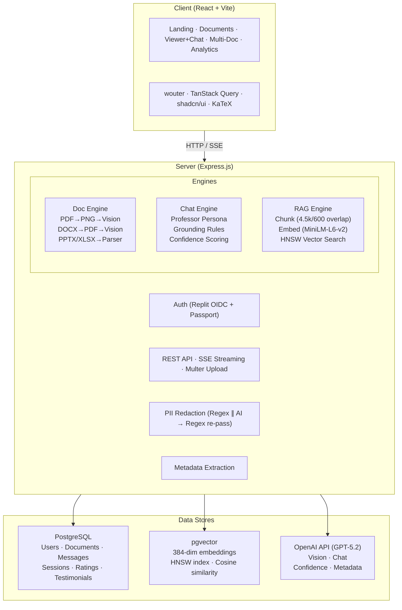
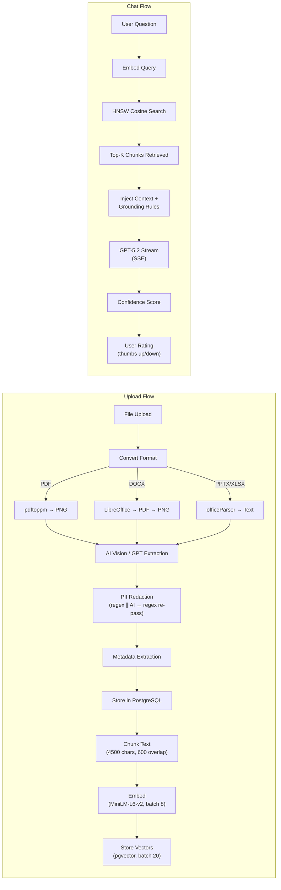
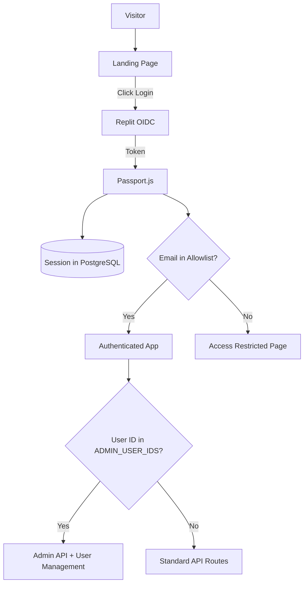
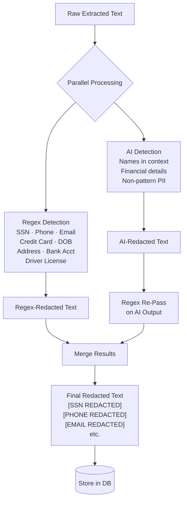
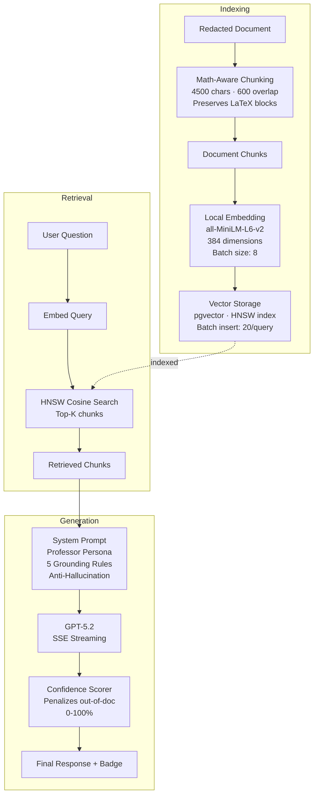
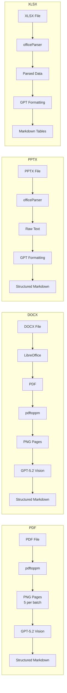

# DocuAnnexure - Document Analysis Application

## Overview
DocuAnnexure is a document analysis and chat application designed to be a central hub for internal knowledge access. It enables users to upload various document types (PDF, PowerPoint, Word, Excel), extract rich content using AI vision, and interact with the content through an AI-powered chat interface. The system leverages Retrieval-Augmented Generation (RAG) with local vector embeddings to provide intelligent and context-aware responses. Key capabilities include PII detection and redaction, advanced metadata extraction for various domains (academic, real estate), and comprehensive analytics. The project aims to streamline information retrieval, enhance document understanding, and offer a secure, intelligent knowledge management solution.

## System Architecture
**Frontend**: Built with React + Vite, styled using Tailwind CSS and shadcn/ui components, utilizing wouter for routing. Key pages include a Landing Page, Document Library, Document Viewer with an integrated chat panel, a Multi-Document Chat interface, an Analytics Dashboard, and administrative User Management.

**Backend**: Implemented with Express.js, using PostgreSQL and Drizzle ORM for data persistence. It handles API routes, user authentication, file uploads, chat engine operations, and RAG processing. Server-Sent Events (SSE) are used for streaming responses.

**Authentication**: Uses Replit Auth (OpenID Connect) via Passport.js, with session-based authentication stored in PostgreSQL. An email allowlist mechanism controls access for a closed evaluation phase.

**AI Integration**: Utilizes OpenAI GPT-5.2 models through Replit AI Integrations for:
-   **Vision**: PDF/DOCX content extraction (tables, formulas, images).
-   **Chat**: Q&A with a "Professor" persona for intelligent responses.
-   **Confidence Scoring**: Evaluating the AI's response confidence (0-100%).
-   **Metadata Extraction**: Identifying document details like DOI, authors, and domain-specific metadata (e.g., real estate properties).

**RAG System**:
-   **Chunking**: Documents are split into approximately 4500-character chunks with 600-character overlap, employing math-aware splitting to preserve LaTeX formulas. PII detection and redaction occur before chunking.
-   **Embedding**: Uses the `all-MiniLM-L6-v2` local embedding model (via `@xenova/transformers`) to generate 384-dimensional vectors.
-   **Vector Storage & Search**: `pgvector` extension in PostgreSQL stores embeddings, leveraging an HNSW index for efficient cosine similarity search to retrieve top-K relevant chunks for RAG.
-   **Fallback**: If a document is not yet indexed, the chat system can fall back to using the full document content.

**Document Processing**:
-   **PDF**: `pdftoppm` converts PDFs to PNG images, which are then processed by GPT-5.2 Vision for markdown extraction (5 pages per batch).
-   **DOCX**: LibreOffice converts DOCX to PDF, then follows the PDF vision pipeline.
-   **PPTX**: `officeParser` extracts text, and GPT formats it into structured markdown.
-   **XLSX**: `officeParser` parses spreadsheets and formats them into markdown tables.
-   **PII Redaction**: Regex and AI redaction run in parallel; regex is re-applied on AI output for full coverage.
-   **Performance**: Embeddings generated in parallel batches of 8; DB chunk inserts batched 20 rows per query.
-   Output includes proper markdown tables, LaTeX math formulas (with client-side `KaTeX` rendering and LaTeX preprocessing), and image descriptions.

**System Design**:
-   **Data Model**: Includes schemas for documents, document chunks, conversations, messages, users, sessions, message ratings, allowed emails, and testimonials.
-   **Security**: All API routes are protected with authentication middleware. PII redaction is a critical security feature, removing sensitive data before storage.
-   **UI/UX**: Features a clean, modern interface with a header-based navigation, a customizable document viewer, and a dynamic chat interface with streaming responses, confidence badges, and rating options. The `Inter` font is applied globally.
-   **Analytics**: Provides an analytics dashboard with metrics on user activity, document uploads, chat performance (confidence distribution, rating trends), and most queried documents.

## High-Level Architecture

## Data Flow

### Authentication & Access Flow

### PII Redaction Pipeline

### RAG Pipeline Detail

### Document Processing by Type

## External Dependencies
-   **OpenAI GPT-5.2**: Accessed via Replit AI Integrations for vision, chat, confidence scoring, and metadata extraction.
-   **PostgreSQL**: Primary database for all application data, including user information, document metadata, chat history, and vector embeddings.
-   **pgvector**: PostgreSQL extension for efficient vector similarity search.
-   **@xenova/transformers**: Used for running the `all-MiniLM-L6-v2` embedding model locally.
-   **pdftoppm (poppler-utils)**: For converting PDF pages to PNG images during document processing.
-   **LibreOffice**: Used for converting DOCX files to PDF for vision-based extraction.
-   **officeParser**: For extracting content from PPTX and XLSX files.
-   **Replit Auth**: OpenID Connect-based authentication service.
-   **Google Analytics**: For tracking user interactions and route changes.
-   **KaTeX**: For client-side rendering of mathematical formulas.