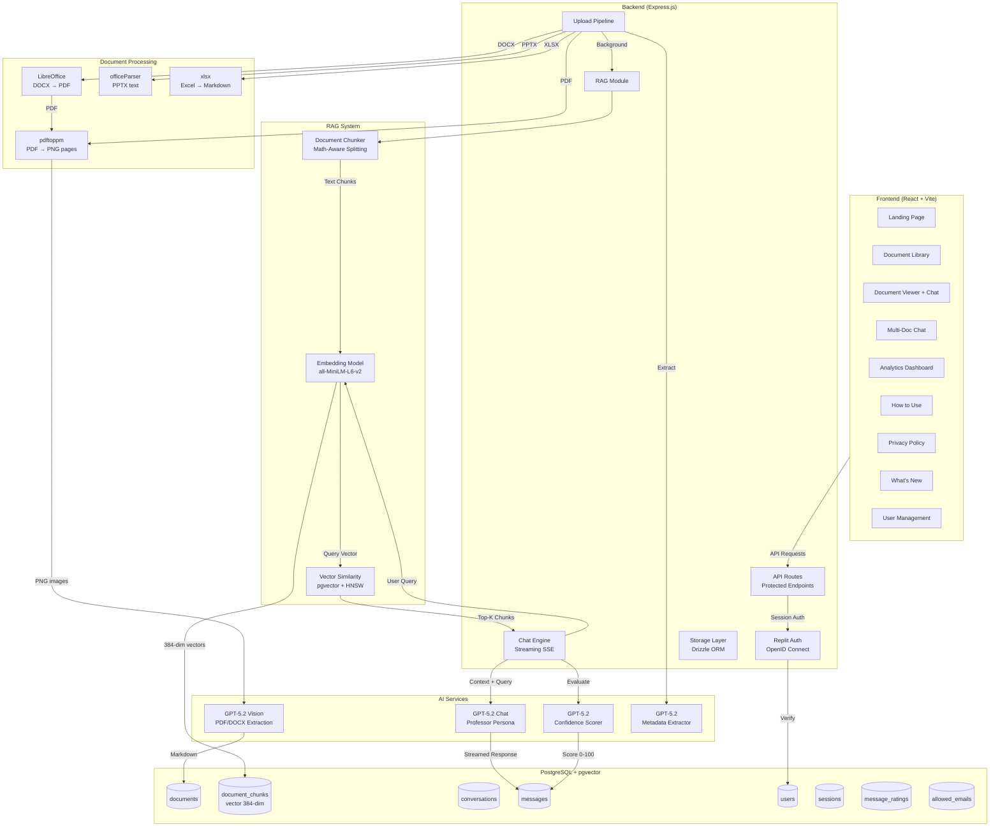
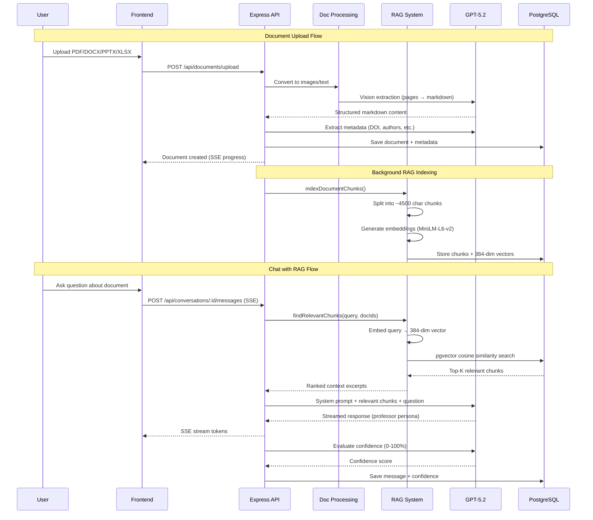

# DocuAnnexure - Document Analysis Application

## Overview
DocuAnnexure is a central hub for document inference and chat-driven access to internal knowledge. It accepts PDF, PowerPoint, Word, and Excel files, extracts rich content (tables, formulas, images) using AI vision, and provides an AI-powered chat interface for Q&A about document content. Uses RAG (Retrieval-Augmented Generation) with local vector embeddings for intelligent context retrieval.

## Architecture Diagram

## Data Flow

## Architecture
- **Frontend**: React + Vite, Tailwind CSS (Inter font), shadcn/ui, wouter routing
- **Backend**: Express.js, PostgreSQL + Drizzle ORM
- **Auth**: Replit Auth (OpenID Connect) via passport, session-based with PostgreSQL session store
- **AI**: OpenAI GPT-5.2 via Replit AI Integrations (vision for PDF extraction, chat for Q&A)
- **RAG**: all-MiniLM-L6-v2 local embedding model (384-dim), pgvector with HNSW index for cosine similarity search
- **Document Processing**: 
  - PDF: pdftoppm (poppler-utils) converts pages to PNG images -> GPT vision extracts markdown
  - DOCX: LibreOffice converts to PDF -> vision pipeline (officeParser as fallback)
  - PPTX: officeParser extracts text -> GPT formats into structured markdown
  - XLSX: xlsx library parses spreadsheets -> formatted markdown tables
  - Output includes proper markdown tables, LaTeX math formulas, and image descriptions

## Key Files
- `server/routes.ts` - API routes (all protected with isAuthenticated middleware)
- `server/index.ts` - Server setup, auth wired before routes via setupAuth + registerAuthRoutes
- `server/rag.ts` - RAG system: chunking, embedding (all-MiniLM-L6-v2 local model, 384-dim), pgvector similarity search
- `server/replit_integrations/auth/` - Auth module (replitAuth.ts, storage.ts, routes.ts)
- `shared/schema.ts` - Database schema (documents, conversations, messages, users, sessions)
- `shared/models/auth.ts` - Auth schema (users, sessions tables)
- `shared/models/chat.ts` - Chat schema with documentIds array for multi-doc conversations
- `shared/models/document.ts` - Document and document_chunks schemas
- `shared/routes.ts` - Shared API route definitions
- `server/storage.ts` - Database storage interface with metrics aggregation
- `client/src/App.tsx` - Root app with auth guard: Landing for logged-out, AuthenticatedApp for logged-in
- `client/src/lib/latex-utils.ts` - LaTeX preprocessing for math rendering (converts \[...\] to $$...$$)
- `client/src/pages/Landing.tsx` - Landing page with hero, features, login CTA
- `client/src/pages/Home.tsx` - Document library (authenticated)
- `client/src/pages/DocumentView.tsx` - Document viewer with markdown rendering and chat panel
- `client/src/pages/MultiDocChat.tsx` - Multi-document chat with document selection, chat history sidebar
- `client/src/pages/Metrics.tsx` - Analytics dashboard with stats, charts, and activity tracking
- `client/src/pages/Privacy.tsx` - Privacy & Data Policy page (accessible without login)
- `client/src/hooks/use-auth.ts` - React hook for authentication state
- `client/src/components/ChatInterface.tsx` - AI chat with streaming responses
- `client/src/components/UploadZone.tsx` - Drag-and-drop file upload

## RAG System Details
- **Chunking**: Math-aware splitting at ~4500 chars with 600-char overlap; detects open LaTeX blocks (`$$`) to avoid splitting mid-equation; falls back to paragraph-based splitting
- **Embedding**: all-MiniLM-L6-v2 via @xenova/transformers (runs locally, no API key needed); produces 384-dimensional vectors
- **Storage**: `document_chunks` table with `embedding vector(384)` column + HNSW index (`vector_cosine_ops`)
- **Search**: Cosine similarity via pgvector `<=>` operator; retrieves top-K (default 15) most relevant chunks
- **Initialization**: `initVectorSupport()` runs at startup to ensure pgvector extension, embedding column, and HNSW index exist
- **Fallback**: If a document has no chunks (not yet indexed), chat falls back to sending full document content

## Recent Changes
- 2026-02-09: Added Replit Auth with landing page, user profile/logout in header, protected API routes
- 2026-02-09: Added Metrics page at /metrics with stat cards, bar chart, pie chart, and recent activity
- 2026-02-09: Added chat history to multi-doc chat (load, delete past conversations)
- 2026-02-09: Removed sidebar, switched to header-based navigation (Documents, Chat, Metrics tabs)
- 2026-02-09: Made branding more prominent with larger title and always-visible tagline
- 2026-02-09: Fixed bug where documents couldn't be changed mid-chat
- 2026-02-09: Added multi-document chat feature at /chat route
- 2026-02-09: Replaced pdf-parse with vision-based extraction using pdftoppm + GPT-5.2
- 2026-02-09: Added remark-gfm, remark-math, rehype-katex for table/formula rendering
- 2026-02-13: Optimized document upload speed: lower DPI (120), skip AI formatting for simple text PDFs/Office docs
- 2026-02-13: Added "How to Use" page at /how-to-use with step-by-step guide and FAQ
- 2026-02-13: Added admin metrics: /api/admin/metrics and /api/admin/check endpoints, admin toggle on Metrics page (admin user ID: 54463549)
- 2026-02-14: Revamped all AI system prompts for scientific/research, health/medical, and education/academic domain expertise
- 2026-02-14: Revamped Chat tab: auto-selects all docs, instant typing (no Start button), smart prompt suggestions, compact doc picker dropdown
- 2026-02-14: Added domain use case cards (Scientific, Health, Education) to Home page with example prompts
- 2026-02-14: Added copy button and thumbs up/down rating to AI chat responses (both single-doc and multi-doc chat)
- 2026-02-14: Added message_ratings table, rating API routes (/api/messages/:id/rate, /api/ratings/metrics, /api/admin/ratings/metrics)
- 2026-02-14: Added AI Response Accuracy card to Metrics page (personal and admin views) showing thumbs up/down counts and accuracy percentage
- 2026-02-15: Redesigned Metrics page with antd-style cards, summary line, timestamps, upload trend, avg messages/chat, most queried documents
- 2026-02-15: Increased document upload limit from 3 to 10
- 2026-02-15: Added version check banner that detects new publishes and prompts users to refresh
- 2026-02-15: Added "What's New" changelog page at /changelog with timeline layout and release notes
- 2026-02-15: Added email allowlist for closed evaluation phase, with Access Restricted page for unauthorized users
- 2026-02-18: Moved allowed emails from hardcoded array to database (allowed_emails table), added admin User Management page at /admin/users for adding/removing users without republishing
- 2026-02-15: Added AI confidence score feature: GPT evaluates its own response confidence (0-100%), stored in messages.confidenceScore column, displayed as color-coded badge on chat responses, with avg confidence metrics on Metrics page (personal + admin)
- 2026-02-15: Added confidence metrics API routes: /api/confidence/metrics (personal), /api/admin/confidence/metrics (admin)
- 2026-02-16: Upgraded DOCX extraction to vision-based: LibreOffice converts DOCX→PDF, then pdftoppm+GPT vision extracts tables, figures, images (mammoth/officeParser as fallback)
- 2026-02-16: Added Excel file support (.xlsx, .xls) with spreadsheet-to-markdown formatting
- 2026-02-16: Added document metadata extraction: DOI detection (regex + GPT), title, authors, journal, year, abstract, keywords extracted during upload
- 2026-02-16: Added metadata panel on DocumentView page (collapsible card with DOI link, authors, keywords badges)
- 2026-02-16: Document cards show academic title, authors, DOI badge, journal/year instead of just filename
- 2026-02-16: Added Privacy & Data Policy page at /privacy (accessible without login) with disclaimer section on landing page
- 2026-02-20: Replaced AI Quality card with Agent Evaluation section on Metrics page: confidence distribution (High/Medium/Low buckets), rating trend (6-week stacked bars), plus accuracy and confidence summaries
- 2026-02-20: Added API routes: /api/confidence/distribution, /api/admin/confidence/distribution, /api/ratings/trend, /api/admin/ratings/trend
- 2026-02-26: Implemented RAG (Retrieval-Augmented Generation) system using pgvector for semantic search
- 2026-02-26: Added document_chunks table with vector(384) embeddings and HNSW index (created at runtime via initVectorSupport)
- 2026-02-26: Local embedding model (all-MiniLM-L6-v2) via @xenova/transformers — no external API needed
- 2026-02-26: New documents auto-indexed during upload; chat uses RAG retrieval when chunks exist, falls back to full-context for non-indexed docs
- 2026-02-26: Added reindex API (POST /api/documents/:id/reindex), chunk status API (GET /api/documents/:id/chunks)
- 2026-02-26: Added "Build Index" button on DocumentView for older documents, shows "RAG Indexed" badge when done
- 2026-02-26: Added Google Analytics (G-YTW4Q7BHN1) with SPA route-change tracking
- 2026-02-26: Added LaTeX preprocessing (client/src/lib/latex-utils.ts) to convert \[...\] → $$...$$ and ensure display math newlines
- 2026-02-26: Applied Inter font globally via CSS variables
- 2026-02-26: Added KaTeX overflow scrolling for long formulas
- 2026-02-26: Adjusted DocumentView panel sizes (40/60 split favoring chat)

## Running
- `npm run dev` starts Express backend + Vite frontend on port 5000
- PostgreSQL via DATABASE_URL env var
- Vector support (pgvector extension, embedding column, HNSW index) initialized automatically at startup
